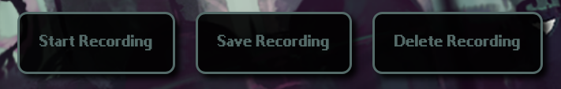

## What is Threatmixer?

Threatmixer is a webpage which will allow the user to play with and mix the various threat themes from the game Rain World. I was heavily inspired by Incredibox, a game where you take various sound elements and mash them together to make your own music. Thinking about how fun it was to expiriment with different sound combinations in Incredibox, I thought about how cool it'd be if you could mix and match the layers of a threat theme at will, sparking the idea for this project.

## How to use it

When you first open the page, you'll be greeted with a screen which prompts you to select a region name from a drop-down menu. Once you've made your choice, hit the "Begin!" button to start mixing that region's threat themes! 

After a short loading screen, you'll then be brought to your region's "home" screen. For this example, let's say you picked Outskirts.

Here, from top to bottom, you'll see:
# 1. The name of the region you selected & back button

The title is just a nice reminder of what region you've selected. Nothing more, nothing less.
The exit button does what it says on the tin, and will bring you back to the region selector when you want to try out a different region.

# 2. A progress bar to let you know how much longer the song is

Like the title and exit button, this one is also pretty self-explanatory. When the song loop begins, the bar will begin to fill up as the song continues. When the loop reaches its end, the bar will automatically restart at the beginning in time with the song. Use it to get a feel for when you should add or remove layers from the threat theme for the perfect mix!

# 3. Buttons corresponding to that region's threat layers

Each button in this row corresponds to a single layer in the Outskirts threat theme. Clicking them after the song has started will toggle whether that layer is muted or not. The smaller buttons labeled "solo" can single out the layer above them, making that sound the only thing that's unmuted. Only one layer can be soloed at a time, and you must hit the same solo button twice in order to unmute all of the other layers that were playing before.

# 4. Buttons to control how the song plays

The "start" button begins the song with however many layers you've chosen to, well, start with. Simply click the layer button for each layer you want start off with as unmuted, and then hit the start button once you're ready. 
The "play all" button will play every layer at once and start the song if it hasn't started yet. If the song has already started, then the button will turn into an "reset song" button, in which case it will do what it says on the label, bringin the song back to the beginning.
The "pause" button will halt all layers without muting or unmuting them. You can still manually mute and unmute layers while the song is paused though. Use this to your advantage to get really creative with your mixes!

# 5. Buttons to handle recording your mixes

The "record" button will begin listening to the audio produced by the page (not your mic or any other audio source) once clicked. If the song hasn't started yet, pressing this button will queue the recording for it to start as soon as the song does. The "pause" button also pauses recordings, so don't worry about any gaps in audio when frequenetly pausing and unpausing while recording.
The "save recording" button will bring up a prompt for you to enter the name of your recording before downloading it as an mp3 onto your computer. Entering nothing into the prompt will simply make the page return to you with a "null.mp3", which will still function like any other mp3 exported from this page.
The "delete recording" button will stop a recording and won't save it onto you computer, allowing you to begin a new one right after. You can also cancle queued recordings with this button before the song starts, in case you change your mind. Returning to the region selector and/or refreshing the page will also automatically stop any recordings.

And that's pretty much everything you need to know about how to use this webpage. Have fun mixing and playing with your favorite region's threat theme!

## Developement progress

With a large graphics overhaul, the page is finally finished...-ish. While I'm pretty happy with its presentation now, it doesn't quite feel complete yet. I know that there are a few things I need to touch up on, mainly some more ui things and the audio files themselves, but those are pretty minor things overall. The webpage consistently functions how I want it to, which is amazing. There's just some very small things that need some changes in order for this to truly feel nearly perfect to me. Perfect enough for it to be considered the first actual version anyways. Consider this version 0.9. The next push will be the actual finished product.

## TODO:

? = unsure if actually adding

1. Finishing touches
    - Refining audio files
    - Pts.js integration?
2. Extra stuff
    - Modded/Custom threat themes
    - Auto play feature?
    - Responsive design?